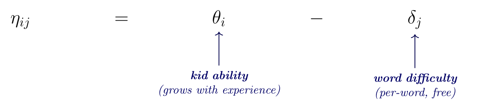
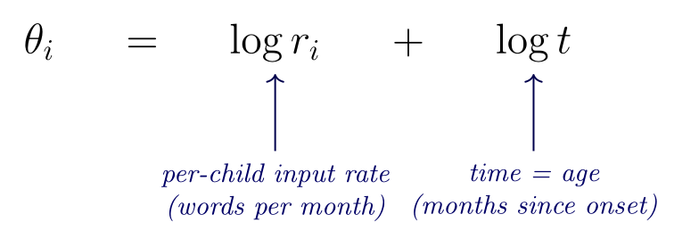
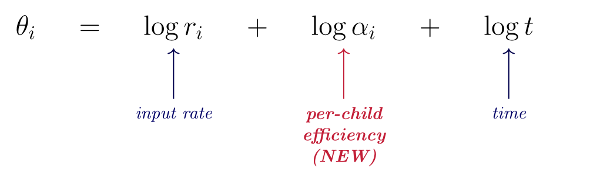
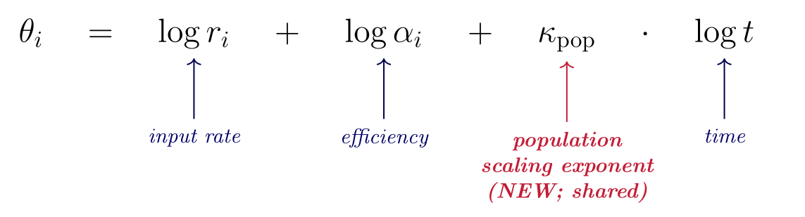
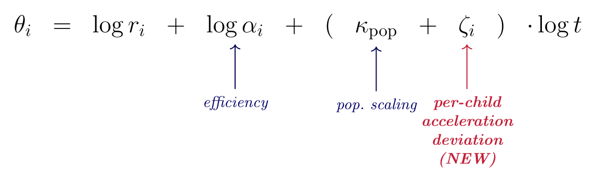
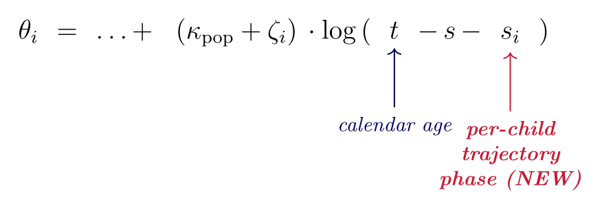

## Vocabulary growth

**Theoretical:** Vocabulary is a key nexus of language, social cognition, and conceptual development. 

**Practical:** Variation in vocabulary growth is a key precursor of
academic outcomes.

**Methodological:** Vocabulary count has a property nearly no other
psychological metric has: a true zero, so we can explore the psychometrics of learning.

**Comparative:** We can explore how LLMs relate to children using dense data about child outcomes.

## Wordbank Data

::: columns
::: {.column width="55%"}

MacArthur--Bates Communicative Development Inventory (CDI):
parent-report checklist of $\sim$ 680 words. 

We focus on production (less noisy). 

**Wordbank**: open repository of CDI administrations. $\sim$ 30
languages, $\sim\!10^5$ children. We use both:

- **Cross-sectional**: one snapshot per child
- **Longitudinal**: $\geq 2$ admins per child, lets us track per-child
  growth

Large $N$, parent-report calibrated to direct testing, cross-linguistically validated.
:::
::: {.column width="45%"} 

\textit{One child = one point.
Vocabulary $\times$ age in English (American) WS.}
:::
:::

## Two signatures of vocabulary growth

::: columns
::: {.column width="50%"}
\textbf{Signature 1: acceleration.} Each quantile curve is concave up: doubling age more than doubles vocabulary. The growth rate accelerates.

\textbf{Signature 2: variability.} The quantile lines fan out: between-child differences in vocabulary grow with age, not shrink.

\textbf{These signatures are remarkably robust:} replicate across languages, samples, and forms. Any model of early word learning must explain both.

:::
::: {.column width="50%"}

:::
:::

## Is growth pure accumulation?

::: columns
::: {.column width="55%"}

Each child has input rate $r_i$; word $j$ has difficulty $\delta_j$.
A word is acquired when enough tokens accumulate.

Derived from cross-situational word learning and other associative/statistical learning ideas.

**In the literature:**

- McMurray (2007) --- pure rate $\times$ time
- Mitchell & McMurray (2009) --- + leverage feedback
- Hidaka (2013) --- cumulative-Weibull; rate change
- Mollica & Piantadosi (2017) --- per-word Gamma
- Kachergis et al. (2021) --- IRT Rasch + $\alpha_i$

**Acceleration:** Some models have changes in efficiency to create acceleration, others do not. 

**Variation:** Between-child variation only in baseline ($r_i$ or $\alpha_i$). No variation in efficiency. 

:::
::: {.column width="45%"}

{width=95%}

\textit{Each child hears tokens at rate
$r_i \cdot p_j$; word $j$ is acquired when its bucket fills past $\delta_j$.}
:::
:::

## Item response theory (IRT)

::: columns 
::: {.column width="55%"}
IRT describes a family of models of binary data (like CDI data).

We use the Rasch model, a logistic model where each item has a single difficulty parameter $\delta$, and each person has a single ability parameter $\theta$. 

Probability of success on an item is then just:
$$
P(w_{i,j} = 1 | \theta_i, \delta_j) = \frac{\exp(\theta_i - \delta_j)}{1 + exp(\theta_i - \delta_j)}
$$
:::

:::
{width=95%}
:::

:::

## A puzzle: input matters less than supposed

::: columns
::: {.column width="55%"}

The accumulator view predicts variation in growth comes from variation
in input quantity. Coffey & Snedeker (2026) meta-analyzed 71 studies,
4,760 children:

**$R^2$ of input on outcome = 0.04--0.07.**

Caregiver speech quantity explains 4--7\% of variance in language
outcome --- a real but small effect.

<!-- A huge variance budget unexplained. *Where does the other 90\% live?* -->

**Hypothesis:** Variability comes from *how children accelerate*, not how much input they hear. 
<!-- Modeling this requires freeing two parameters prior models pin. -->
:::
::: {.column width="45%"}

{width=95%}

\textit{Between-child SD($\theta$) grows
from $\sim$ 1.7 to $\sim$ 2.3 logits between 16 and 30 mo. If input
explains $\sim$ 5\%, the rest comes from somewhere.}
:::
:::

## This work: modeling individual variability in acceleration

We build a Bayesian model to estimate three things directly:

1. **Acceleration.** Is population vocabulary growth
  super-linear in cumulative input?

2. **Variability.** Do children differ in *how* and
  *when* their growth accelerates, not just in baseline ability?

3. **Input share.** How much of the between-child variance is
  attributable to input rate, vs.\ to internal factors like efficiency?

Does the same machinery applied to large language models
yield the same answers? **Spoiler**: no --- LLMs show a categorical
disanalogy with children's learning. (Later in the talk.

# Building the model: individual variability in acceleration

## The accumulator hypothesis

::: columns
::: {.column width="55%"}

**The shared idea.** Each child accumulates word-evidence at her own
input rate $r_i$; word $j$ is acquired once its difficulty $\delta_j$
is crossed.

**Ability scales as a power of input.** If kids vary only in *rate*,
then ability grows as $\text{(tokens)}^{1}$ --- the pure *unit
accumulator*. Between-child differences come only from differences in
$r_i$.

**What our model will check.**

- Is the growth exponent really 1, or steeper?
- Are children all alike except for input rate, or do they also differ
  in efficiency, in growth rate, and in when growth starts?
:::
::: {.column width="45%"}

{width=92%}

\textit{Bucket-fill metaphor: each child
hears tokens at rate $r_i \cdot p_j$; word $j$ is acquired when its
bucket fills past difficulty $\delta_j$ (Kachergis et al.\ 2021).}
:::
:::

## Prior accumulator models: structural lineage

\begin{description}\setlength\itemsep{0.5em}
\item[McMurray (2007).]
  Pure accumulator. Each word $w$ has acquisition threshold $\tau_w$
  from population distribution $g(\tau)$. Acceleration requires $g'(\tau) > 0$.
\item[Mitchell \& McMurray (2009).]
  McMurray $+$ leverage feedback $a(t) = t + cL(t)$. \emph{Shifts}
  growth without creating acceleration.
\item[Hidaka (2013).]
  Closed-form AoA distributions: cumulative (Gamma), rate-change
  (Weibull, exponent $D$ on time), or both.
\item[Mollica \& Piantadosi (2017).]
  Per-word Gamma waiting time: AoA $\sim \Gamma(k_w, \lambda_w)$.
\item[Kachergis et al.\ (2021).]
  1-PL Rasch IRT with per-child $\theta_i$ and linear age covariate.
\end{description}

\textit{Each uses different notation. After we
introduce our model, we'll re-express each in our coordinates and
compare structurally.}

## The model: Rasch IRT + accumulator dynamics

$P(\text{produces}_{ij}) = \sigma(\eta_{ij})$
  with  
 $\eta_{ij} = \theta_i - \delta_j$

{width=80%}

This is a standard Rasch IRT model. The substantive content is in how
$\theta_i$ depends on accumulated experience. We build that up in
three steps.

## Step 1: pure accumulator

$\theta_i = \log r_i + \log t$
  $\Longleftrightarrow$  
$\exp(\theta_i) = r_i \cdot t$

{width=80%}

**Ability = rate $\times$ time.** The only thing that changes across
development is more accumulated input. The only source of variation
between children is variation in the input rate $r_i$.

## Step 2: + per-child efficiency $\alpha_i$

$\theta_i = \log r_i + \log \alpha_i + \log t$
  $\Longleftrightarrow$  
$\exp(\theta_i) = \alpha_i \cdot r_i \cdot t$

{width=80%}

Each child has a multiplicative efficiency $\alpha_i$ over and above
their input rate. **The question we'll ask of the fit:** how much of
the between-child variance comes from efficiency vs.\ input rate? We
summarize this share as $\pi_\alpha = \sigma_\alpha^2 / (\sigma_\alpha^2 + \sigma_r^2)$.

## Step 3: + population acceleration $\kappa_{\text{pop}}$

$\theta_i = \log r_i + \log \alpha_i + \kappa_{\text{pop}} \log t$
  $\Longleftrightarrow$  
$\exp(\theta_i) = \alpha_i \cdot r_i \cdot t^{\kappa_{\text{pop}}}$

{width=80%}

The population accelerates: ability scales as $t^{\kappa_{\text{pop}}}$
super-linearly. All children still share one $\kappa_{\text{pop}}$. **What we'll
ask:** is $\kappa_{\text{pop}}$ really above 1 --- i.e., does ability grow faster
than a unit accumulator predicts? This is Hidaka's rate-change model.

## Step 4: + per-child acceleration $\zeta_i$

$\theta_i = \log r_i + \log \alpha_i + (\kappa_{\text{pop}} + \zeta_i) \log t$

{width=80%}

**Each child has her own growth exponent $\kappa_i = \kappa_{\text{pop}} + \zeta_i$.**
The new piece: between-child variation isn't just in baseline ability,
but in *how trajectories accelerate*. Every prior accumulator model
forces every child to share one growth rate. **What we'll ask:** do
children really differ in how fast their vocabulary accelerates?

## Step 5: + per-child trajectory phase $s_i$

$\theta_i = \log r_i + \log \alpha_i + (\kappa_{\text{pop}} + \zeta_i)\,\log(t - s - s_i)$

{width=80%}

The same kind of individual-variability addition, but on the *time*
dimension: children differ in *when* their developmental clock
effectively starts. $s_i$ can be positive (later start) or negative
(developmentally ahead). **What we'll ask:** does the timing of growth
onset really vary across children, alongside how fast they accelerate?

## What every prior model pins; what we free

\renewcommand{\arraystretch}{1.30}
\begin{tabular}{@{}lccccl@{}}
\hline
\textbf{Model} & \textbf{efficiency} & \textbf{pop.\ growth} & \textbf{per-child} & \textbf{per-child} & \textbf{Per-word} \\
              & $\boldsymbol{\sigma_\alpha}$ & $\boldsymbol{\kappa_{\text{pop}}}$ & \textbf{growth} $\boldsymbol{\sigma_\kappa}$ & \textbf{phase} $\boldsymbol{\sigma_s}$ & $\boldsymbol{\delta_j}$? \\
\hline
McMurray (2007)              & $0$    & $1$     & $0$ & $0$ & free, $\delta_j = \log\tau_j$ \\
Mitchell \& McMurray (2009)  & $0$    & $1^{*}$ & $0$ & $0$ & free, plus leverage $c$ \\
Hidaka (2013) cumulative     & $0$    & $1$     & $0$ & $0$ & free, $\delta_j = \log(N_j/\delta)$ \\
Hidaka (2013) rate-change    & $0$    & $D{+}1$ & $0$ & $0$ & free \\
Mollica \& Piantadosi (2017) & $0$    & $1$     & $0$ & $0^{**}$ & free, $\delta_j = \log(k_j/\lambda_j)$ \\
Kachergis et al.\ (2021)     & free   & free    & $0$ & $0$ & free \\
\hline
\textbf{Best-fitting model (this work)} & \textbf{free} & \textbf{free} & \textbf{free} & \textbf{free} & \textbf{free} \\
\hline
\end{tabular}

**What's structurally new.** Every prior model pins $\sigma_\kappa$ and
$\sigma_s$ to zero (same growth rate and onset for all kids). Our
model frees both; we find $\sigma_\kappa \approx 3.5$ and
$P(\kappa_i > 1) > 0.997$ --- the load-bearing additions that let the
model fit acceleration and variability *jointly*.

\textit{$^{*}$Mitchell \& McMurray's leverage
isn't linear in $\log t$. $^{**}$Mollica's Gamma encodes a per-word
offset, but shared across kids. See appendix for each model translated
individually.}

# Input quantity: how much does it really vary?

## Where does $\sigma_r$ come from? The input-rate prior

::: columns
::: {.column width="55%"}

The kid-level intercept $\xi_i = \log r_i + \log\alpha_i$ has total
variance $\sigma_\xi^2$ that the data *does* identify. But the split
between input rate ($\sigma_r^2$) and efficiency ($\sigma_\alpha^2$)
is not separately identified within the model:

$$
\sigma_\xi^2 \;=\; \sigma_r^2 + \sigma_\alpha^2
 \Rightarrow 
\pi_\alpha \;=\; 1 - \frac{\sigma_r^2}{\sigma_\xi^2}
$$

We resolve this by pinning $\sigma_r$ externally --- from data
quantifying actual variation in child-directed input rates across
families. The model then partitions the data-identified $\sigma_\xi^2$
into input and efficiency components.
:::
::: {.column width="45%"}
**The pin matters for $\pi_\alpha$.**

- Bigger $\sigma_r$ $\Rightarrow$ more variance assigned to input
  $\Rightarrow$ lower $\pi_\alpha$.
- Pinning $\sigma_r$ *too low* would overstate efficiency's share;
  *too high* would mask it.

**Strategy.** Compile the empirical literature on adult-token rates
per child, derive a defensible $\sigma_r$, and report a full
sensitivity sweep so the headline doesn't hinge on the central pin.
:::
:::

## Empirical estimates of input-rate variation

\renewcommand{\arraystretch}{1.25}
\begin{tabular}{@{}lrrrrr@{}}
\hline
\textbf{Group} & \textbf{n} & \textbf{Mean} & \textbf{$\pm 1$ SD range} & \textbf{Tokens/month} & \textbf{$\sigma_r$} \\
              &            & \textbf{(tok/hr)} & \textbf{(tok/hr)} & \textbf{mean (range)} & \textbf{(log)} \\
\hline
Western, CDS-mother (Sperry sites, HR, WF) & 17 & $\sim$ 1{,}100 & 620--2{,}000 & 400K \,(230K--730K) & 0.57 \\
Western, all-adult tokens                  &  9 & $\sim$ 2{,}200 & 1{,}450--3{,}400 & 800K \,(530K--1.24M) & 0.43 \\
\textbf{Sperry within-pool, CDS-any-adult} & \textbf{42} & \textbf{$\sim$ 1{,}500} & \textbf{880--2{,}620} & \textbf{547K \,(320K--956K)} & \textbf{0.53} \\
All groups (incl.\ Tseltal, Y\'el\^i, Pirah\~a) & 27 & --- & $\sim$ 300--5{,}000 & ($\sim$ 110K--1.8M) & 1.24 \\
\hline
\end{tabular}

**Central pin: $\sigma_r = 0.534$** from the Sperry within-pool. A
typical Western child hears $\sim$ 547K adult tokens/month ($\pm 1$ SD:
$\sim$ 320K--960K, a 2.5$\times$ spread). The Wordbank CDI:WS sample is
overwhelmingly WEIRD, so the cross-cultural 1.24 is an outer bound,
not a likely value.

*Tokens/month = tokens/hr $\times$ $H$, $H = 365$ hr/mo (12 waking hr/day $\times$ 30.44 days/mo, model convention).*\
**Sources:** Sperry et al.\ 2019, Hart & Risley 1995, Weisleder & Fernald 2013,
Bergelson 2018/2019/2023, Bunce et al.\ 2024, Casillas 2020/2021, Coffey et al.\ 2024.

## Sensitivity: $\pi_\alpha$ across plausible $\sigma_r$

::: columns
::: {.column width="58%"}

:::
::: {.column width="42%"}

$\pi_\alpha(\sigma_r) = 1 - \sigma_r^2/\sigma_\xi^2$, with $\sigma_\xi$
fixed at its data-identified posterior.

**Central pin $\sigma_r = 0.534$:** $\pi_\alpha \approx 0.91\!-\!0.94$.

**Doubled $\sigma_r = 1.2$ (cross-cultural upper bound):**
$\pi_\alpha$ still $> 0.55$.

**Halved $\sigma_r = 0.30$ (below any defensible single-site SD):**
$\pi_\alpha \approx 0.97$.

**Conclusion.** The efficiency-dominated decomposition holds across
the full range supported by Western input data, and the qualitative
answer survives even the cross-cultural upper bound.
:::
:::

## Caveat: this is about input *quantity*, not *quality*

**What we've modeled.** Variation in input *quantity* --- how many
adult tokens per hour each child hears. Under this lens, between-child
differences in vocabulary growth are mostly *not* explained by input
quantity.

**What we haven't modeled.** Variation in input *quality* --- diversity,
contingency, conversational structure, child-directed register.
Quality variation is real and may matter for learning.

**Why this is still a defensible scope:**

- **Quality is hard to measure at scale.** No cross-population
  benchmark analogous to LENA-style token rates.
- **Quality would have to be enormous to escape the finding.** A
  per-child age-varying quality multiplier
  $q_i(t) = (t/a_0)^{\gamma_i}$ is observationally equivalent to a
  steeper $\kappa_i$ --- so to absorb the observed acceleration,
  "quality" would need to grow $\sim$ 3{,}000$\times$ for the median
  kid and $\sim$ 10$^6\times$ for the 95th percentile between 12 and
  30 mo. (See appendix.)

**Bottom line.** Quantity is too small and too well-measured to
explain the variability; quality would have to be implausibly large
and age-varying to substitute.

# Results: English and Norwegian longitudinal fits

## Data and compute for the longitudinal fits

**Data.**

- **English Wordbank (WS form).** $I = 500$ children, $\sim$ 1500
  administrations, $J = 671$ items (full WS list), $N \approx 1.1$M
  observed responses. Stratified-by-median-age sampling.
- **Norwegian Wordbank.** $I = 500$ children, $\sim$ 3000 administrations,
  $J = 716$ items, $N \approx 2.2$M responses. Same stratification.

**Model family.** The same five-step build run as a sequence of Stan
models on each dataset: `pure`, $+\alpha$, $+\kappa_{\text{pop}}$,
$+\zeta_i$, $+s_i$. Each fit warm-starts from the previous one's
posterior.

**Compute.** Two GCP virtual machines (`n2d-standard-128`, 64 physical
AMD EPYC cores each, 128 GB RAM), one per language, running in
parallel. Stan with `reduce_sum` threading: 4 chains $\times$ 16
threads/chain saturates the 64 physical cores per machine. $\sim$ 11h
per fit, $\sim$ 55h per VM for the five-variant family; the two VMs run
in parallel, so $\sim$ 55h wall-clock and $\sim$ 110h of 128-core VM time
total. No GPUs.

**Priors and pins.** $s = 6$ mo (population trajectory anchor);
$\sigma_r = 0.534$ (Western-CDS empirical pin, see previous slides).
Posteriors with $\hat R < 1.05$ on all parameters of interest.

## Each addition matters: 5-panel comparison to data

{width=70%}

\begin{footnotesize}
\textbf{Reading.} Each panel adds one mechanism. Pure accumulator collapses kids to one trajectory; $\sigma_{\alpha}$ adds vertical spread; $\kappa_{\text{pop}}$ adds curvature; $\sigma_{\zeta}$ opens the fan with age; $\sigma_{s}$ handles the floor at young ages.
\end{footnotesize}

## Same story in $\theta$-space

{width=96%}

\textit{Same five-panel build, but plotting
latent ability $\theta_i(t)$ directly instead of integrating to vocabulary.
Population mean (bold), 10th/90th percentiles (blue/red), 100 simulated
kids (faint). Dotted: $\theta_{50\%}$, the value at which a typical-difficulty
word has 50\% acquisition probability.}

\begin{small}
\textbf{What it shows.} The first two panels never cross
$\theta_{50\%}$ within the data range --- pure accumulators (with or
without efficiency variation) are structurally unable to fit children's
acquisition. Each subsequent panel adds a structural mechanism the
data demands.
\end{small}

## Best-fitting model: parameter posteriors

\renewcommand{\arraystretch}{1.20}
\begin{tabular}{@{}llp{8cm}@{}}
\hline
\textbf{Parameter} & \textbf{Posterior} & \textbf{What it does} \\
\hline
$\sigma_\alpha$   & 1.71 \,[1.55, 1.91]   & Between-child efficiency variation. \\
$\boldsymbol{\pi_\alpha}$ & \textbf{0.91 \,[0.89, 0.93]} & \textbf{Share of intercept variance from efficiency, not input.} \\
$\boldsymbol{\kappa_{\text{pop}}}$ & \textbf{10.35 \,[10.21, 10.51]} & \textbf{Population scaling exponent: ability scales as (tokens)$^{\kappa_{\text{pop}}}$.} \\
$\boldsymbol{\sigma_{\zeta}}$ & \textbf{3.47 \,[3.14, 3.84]} & \textbf{Between-child variation in scaling exponent.} \\
$\boldsymbol{\sigma_{s}}$ & \textbf{[refits pending]} & \textbf{Between-child variation in trajectory phase.} \\
$\rho(\xi,\zeta)$ & $+0.35$ \,$[+0.22, +0.47]$ & Higher-baseline kids have steeper growth. \\
\hline
\end{tabular}

::: columns
::: {.column width="32%"}
\textbf{Variability}\\[0.2em]

$\pi_\alpha = 0.91$: efficiency variance dominates input variance.
:::
::: {.column width="32%"}
\textbf{Acceleration}\\[0.2em]

$\kappa_{\text{pop}} \approx 10.4 \gg 1$: scaling is wildly super-linear, far from the unit accumulator.
:::
::: {.column width="36%"}
\textbf{Variation in scaling}\\[0.2em]

$\sigma_\kappa > \sigma_\alpha$: kids vary more in scaling exponent than in baseline.
:::
:::

## Cross-language acceleration

\renewcommand{\arraystretch}{1.20}
\begin{tabular}{@{}lcccc@{}}
\hline
\textbf{Sample} & \textbf{admins/kid} & $\boldsymbol{\kappa_{\text{pop}}}$ & $\boldsymbol{\sigma_\kappa}$ & \textbf{kid range ($\kappa_{\text{pop}} \pm 2\sigma_\kappa$)} \\
\hline
English   & median 3 & 10.4 \,[10.2, 10.5] & 3.5 \,[3.1, 3.8] & $\sim$ 3 to 17 \\
Norwegian & median 8 & 12.4 \,[12.3, 12.6] & 3.7 \,[3.4, 4.2] & $\sim$ 5 to 20 \\
\hline
\end{tabular}

::: columns
::: {.column width="55%"}
**$\kappa_{\text{pop}} \sim 10\!-\!12$ in both languages**, with
$P(\kappa_i > 1) > 0.997$.

**$\delta$ vs.\ $\zeta_i$ decomposition is identifiability-dependent.**
In Norwegian (8 admins/kid), per-child slopes are well-identified ---
dropping $\zeta_i$ *hurts* fit by 235 ELPD. In English (3 admins/kid),
$\delta$ pools what Norwegian's data lets fall into $\zeta_i$.
:::
::: {.column width="45%"}
**Reading.** The acceleration signature is universal. Its internal
parameterization is identifiability-dependent on data density.

*In any dense longitudinal sample, between-child $\kappa_i$ spans
roughly $5\!-\!15$.*
:::
:::

# Extensions: directly observed input and processing

## Three model extensions: testing $\pi_{\alpha}$ with richer data

The Wordbank longitudinal fits use *population-level* input rate priors
(Sperry/Hart-Risley/Weisleder-Fernald). Two natural follow-ups:

1. **Per-child observed input**: use *measured* per-child input rate
   instead of a population prior. Does $\pi_{\alpha}$ stay $\sim$ 0.9 when
   input is no longer a pooled estimate? **$\to$ BabyView, SEEDLingS.**
2. **Per-child processing efficiency**: link CDI growth to an
   independent per-child readout of processing speed. Does the
   $\sigma_\alpha$ we estimate from CDI reflect "processing efficiency"
   or something else? **$\to$ Peekbank.**

Both extensions reuse the same model machinery with an added channel
in the linear predictor; only the data and the per-child latents
change.

## Replicating with directly observed input

::: columns
::: {.column width="50%"}

**BabyView, $N = 20$**

{width=92%}

$\pi_\alpha = 0.84$ \,[0.68, 0.93]
:::
::: {.column width="50%"}

**SEEDLingS, $N = 44$ (comp corrected)**

{width=92%}

$\pi_\alpha = 0.94$ \,[0.89, 0.97]
:::
:::

With per-recording observed input, the $\pi_\alpha$ headline holds:
input-rate variance is a small share of between-child variance even when measured directly.

## Adding a processing-speed readout: Peekbank LWL

::: columns
::: {.column width="55%"}
**Joint model adds a per-child LWL log-RT readout coupled to
$\log\alpha_i$ via $\gamma_{rt}$.**

**Posterior.**

- $\gamma_{rt} = 0.082$ \,$[0.046, 0.125]$ --- LWL processing speed is
  real, and bounded above zero.
- $\pi_\alpha = 0.90$ \,$[0.86, 0.94]$ --- replicates within the
  Peekbank subset.
- $\rho(\kappa_i, \mathrm{rtslope}_i) = -0.02$ \,$[-0.33, +0.27]$ ---
  CDI-side and LWL-side growth rates do *not* share variance.
:::
::: {.column width="45%"}
**Two clocks, not one.** The acceleration in vocab growth and the
maturation of processing speed are independent maturation processes
within the same child --- different "efficiency clocks" ticking in
parallel.

This rules out the simplest unification ("one underlying efficiency
axis"); the two readouts each pick up a different developmental process.
:::
:::

## $\pi_{\alpha}$ across five samples

\renewcommand{\arraystretch}{1.20}
\begin{tabular}{@{}lrrrl@{}}
\hline
\textbf{Sample} & \textbf{N} & $\boldsymbol{\sigma_{\alpha}}$ & $\boldsymbol{\pi_{\alpha}}$ & \textbf{Channel} \\
\hline
English longitudinal & 200 & 1.83 [1.65, 2.04] & \textbf{0.91 [0.90, 0.93]} & Pooled input prior \\
Norwegian longitudinal & 200 & 2.10 [1.90, 2.35] & \textbf{0.94 [0.93, 0.95]} & Pooled input prior \\
Peekbank (Stanford) & 62  & 1.64 [1.34, 2.03] & \textbf{0.90 [0.86, 0.94]} & Pooled $+$ LWL \\
BabyView & 20  & 1.13 [0.86, 1.61] & \textbf{0.84 [0.68, 0.93]} & Head-mounted video \\
SEEDLingS & 44  & 1.39 [1.13, 1.74] & \textbf{0.94 [0.89, 0.97]} & LENA all-day audio \\
\hline
\end{tabular}

\begin{small}
\textbf{$\pi_{\alpha} \in [0.84, 0.94]$ across all five samples.} The
specific input channel (pooled vs.\ measured) and sample size hardly
move the picture: between-child variance is dominated by something
\emph{other} than input rate.\\
\textcolor{black!50}{\textit{(Placeholder: numbers from s=0.5 fits; s=6 refits running.
The qualitative pattern is invariant.)}}
\end{small}

# Connecting to LLMs

## Why look at LLMs?

LLMs and children both learn word meanings from input. They differ
*enormously* in scale and architecture, but the question of how their
learning scales with input is statistically well-posed:

- For an LM and a word $w$, we have $P(w \text{ produced correctly})$
  as a function of training tokens.
- This is a sigmoid in log-tokens with a per-word slope.
- The same statistic exists for human children: $P(w \text{ acquired})$
  as a function of cumulative input.

**This lets us put kids and LMs on the same axis** --- not just trade
anecdotes about scaling. Two questions:

1. Do kids and LMs have similar per-word acquisition slopes?
2. Does a model that fits kids' learning say anything about LMs?

## Chang & Bergen (2022): per-word sigmoids in LMs

**Setup.** Chang & Bergen trained four LMs (BERT, biLSTM, GPT-2, LSTM)
on the same input corpus (BookCorpus $+$ WikiText). At each of
$\sim$ 200 training checkpoints, they probed each of $\sim$ 611 CDI
words to get $P(\text{word produced correctly} \mid \text{checkpoint})$.

For each (LM, word) they fit a 4-parameter logistic
$$
S_w(x) = \mathrm{lower}_w + \frac{\mathrm{upper}_w - \mathrm{lower}_w}
                                    {1 + \exp((x - \mathrm{mid}_w)/\mathrm{scale}_w)}
$$
where $x = \log_{10}(\text{training steps})$, yielding a per-word
**scaling slope**: how fast that word's acquisition probability rises
with cumulative training. After unit conversion, this is exactly
analogous to our $\kappa_i \log t$ for children.

**Result they reported.** Across the four LMs, mean per-word slope
$\approx 1$ logit per nat-log training-step. Striking but ambiguous:
is this the LM architecture or the input distribution?

## Could the gap be an input-distribution artifact?

**Confound in C&B's setup.** Their LMs trained on BookCorpus + WikiText
(adult written text), not on the speech kids actually hear. So the
slope gap conflates two things: (a) a structural difference in how LMs
and kids scale, and (b) an input-distribution mismatch.

**Test:** retrain GPT-2 small on CHILDES (the corpus kids actually
hear, per Feng et al.\ 2026), keep everything else fixed, refit C&B's
per-word sigmoid. If the gap is input-driven, CHILDES-trained slopes
should rise toward children.

**Setup:**

- GPT-2 small (124M params, 12L $\times$ 768d $\times$ 12h)
- CHILDES train split, $\sim$ 24.5M tokens, 20 epochs (Feng et al.\ §B spec)
- 3 random seeds (\{0, 42, 123\}) as a between-instance variance probe
- 73 log-spaced eval checkpoints; per-word mean NLL over 50 occurrences
  in the CHILDES validation set
- C&B 4-parameter logistic fit per (LM, word); per-word slope = $0.434 / \mathrm{ParamScale}_w$
- 609 / 611 C&B CDI words are single tokens in the GPT2-CHILDES BPE

\begin{footnotesize}
Single L40S 48GB per seed (Stanford Sherlock \texttt{gpu} partition), $\sim$ 8h wall-clock each.
\end{footnotesize}

## The per-word view: CDS training does not move the LM slope

{width=54%}

\begin{tabular}{@{}lrcc@{}}
\hline
\textbf{Population} & \textbf{N} & \textbf{Median} & \textbf{IQR} \\
\hline
Children (English best-fit)              & 5000     & \textbf{10.3}        & [8.0, 12.6]   \\
GPT-2-CHILDES (3 seeds)                  & 609 ea  & \textbf{0.72--0.74}  & [0.43, 1.16]  \\
GPT-2-BookCorpus (C\&B)                  & 604      & 0.81                  & [0.45, 1.54]  \\
BERT, biLSTM, LSTM-BookCorpus            & 593--609 & 0.76--0.96            & ---            \\
\hline
\end{tabular}

\raggedright

\textbf{CHILDES-trained GPT-2 (0.72--0.74)} sits inside the BookCorpus cluster (0.76--0.96), all $\sim\!14\times$ below kids (10.3). \emph{The input-distribution explanation accounts for $\sim$ 0 of the kid-vs-LM gap; the gap is structural.}

## The aggregate view: scaling laws

{width=80%}

Comparing two estimates of *ability gained per token of experience*:
LM scaling laws (Kaplan, Chinchilla compute-optimal, Chinchilla
data-bound) all have exponents $\beta \in [0.10, 0.28]$. Children's
$\kappa_{\text{pop}} \approx 10$ is two orders of magnitude steeper
--- a different scaling regime, not a quantitative degree.

# Synthesis

## Technical summary

- **Acceleration is real and population-level.** {\textit{(placeholder for s=6 refits)}}
  $\kappa_{\text{pop}} \approx 10$, confidently above the unit-accumulator
  boundary $\kappa_{\text{pop}} = 1$. The first prior model to free $\kappa_{\text{pop}}$
  (Hidaka rate-change) was structurally right.
- **Individual variability in acceleration is real too.** $\sigma_{\zeta} > 0$
  and $\sigma_{s} > 0$: children differ not just in baseline ability, but
  in *how their trajectories accelerate* and *when*. No prior
  accumulator model frees these.
- **Input quantity is a small share of between-child variance.**
  $\pi_{\alpha} \approx 0.91$ across 5 samples. Aligns with the meta-analytic
  $R^2 = 0.04$--$0.07$ of Coffey & Snedeker (2026).
- **LLMs are structurally different.** Same per-word sigmoid statistic
  gives $\kappa \sim 1$ for LMs vs.\ $\sim 10$ for children --- a
  10$\times$ gap with near-zero between-instance variance in LMs.

 `github.com/langcog/standard-model-2`

## Two signatures, twin constraints on theory

::: columns
::: {.column width="50%"}
{width=62%}

\begin{footnotesize}
\textbf{Acceleration.} $\kappa_{\text{pop}} \approx 10$ --- above any pure accumulator. \emph{Where does the super-linearity come from?}
\end{footnotesize}
:::
::: {.column width="50%"}
{width=62%}

\begin{footnotesize}
\textbf{Variability.} $\pi_{\alpha} \approx 0.91$: input explains $\sim$ 10\% of between-child variance. \emph{Where does the other 90\% live?}
\end{footnotesize}
:::
:::

\begin{scriptsize}
Twin constraints on any theory: \textbf{(a)} population-level super-linear growth (maturation? learning-to-learn?); \textbf{(b)} individual differences \emph{not} in input quantity (processing? interactional quality?). \emph{Pure accumulators satisfy neither.}
\end{scriptsize}

\appendix

## Appendix: per-child trajectories from the best fit

{width=85%}

120 kids sampled from the best-fitting model's posterior.
**Left:** latent ability $\theta$ (logit). **Right:** predicted vocabulary.
Concave-up shape = super-linear signature; fan width = between-child variability.

## Appendix: $\sigma_r$ sensitivity from earlier cross-sectional fits

::: columns
::: {.column width="55%"}

:::
::: {.column width="45%"}

**Reviewer reflex.** "Maybe kids' tokens differ in *quality*, and
that's what looks like acceleration."

**Structural answer.** Per-child age-varying quality
$q_i(t) = (t/a_0)^{\gamma_i}$ on input is observationally equivalent
to $\gamma_i = \kappa_i - 1$.

**Implication.** Quality cannot escape acceleration --- it *relabels*
it. For the median kid, "quality" would have to grow
$\sim 3{,}000\!\times$ from age 12 to 30 mo. For the 95th percentile
kid, $\sim 10^6 \times$. Implausible as a substantive quality story.
:::
:::

## Appendix: McMurray (2007) in our notation

**Original.** Each word $w$ has threshold $\tau_w \sim g(\tau)$;
deterministic step at $t \ge \tau_w$. Vocabulary $L(t) = G(t)$ (CDF of $g$).
Acceleration requires $g'(\tau) > 0$ over the productive window.

**In our notation:**
$$
\eta_{ij}(t) \;=\; \log t - \log\tau_j \;=\; \kappa \log t - \delta_j
 \text{with}  \kappa \equiv 1,  \delta_j = \log\tau_j.
$$

\renewcommand{\arraystretch}{1.20}
\begin{tabular}{@{}ll@{}}
\hline
\textbf{Parameter} & \textbf{Setting in McMurray} \\
\hline
$\log r_i$         & $\equiv 0$ \,(no per-child rate variation) \\
$\log\alpha_i$     & $\equiv 0$ \,(no efficiency variation) \\
$\boldsymbol{\kappa_i}$ & $\boldsymbol{\equiv 1}$ \,(unit accumulator) \\
$\delta_j$         & free, drawn from $g$ \\
\hline
\end{tabular}

## Appendix: Hidaka (2013) in our notation

**Original.** Three families: cumulative ($N$-accumulator at constant
rate, AoA $\sim \Gamma$), rate-change (1-accumulator at rate
$\delta\cdot t^D$, AoA $\sim$  Weibull), and both. **Rate-change**:
ability $\propto t^{D+1}$; $D > 0$ produces super-linear scaling.

**In our notation (rate-change form):**
$$
\eta_{ij}(t) \;=\; (D+1) \log t - \delta_j
 \text{with}  \kappa_i \equiv D+1.
$$

\renewcommand{\arraystretch}{1.20}
\begin{tabular}{@{}ll@{}}
\hline
\textbf{Parameter} & \textbf{Setting in Hidaka rate-change} \\
\hline
$\log r_i$         & $\equiv \log\delta_{\text{const}}$ \,(shared population rate) \\
$\log\alpha_i$     & $\equiv 0$ \,(no efficiency variation) \\
$\boldsymbol{\kappa_i}$ & $\boldsymbol{\equiv D+1}$ \,(shared, no per-child variation) \\
$\delta_j$         & free \\
\hline
\end{tabular}

**Hidaka's $D = \kappa_{\text{pop}} - 1$ in our notation.** His $D > 0$ is our $\kappa_{\text{pop}} > 1$.

## Appendix: Mollica & Piantadosi (2017) in our notation

**Original.** Per-word: $k_w$ effective learning instances arrive as
Poisson at rate $\lambda_w$; word acquired after $k_w$ events.
$\mathrm{AoA}_w \sim \Gamma(k_w, \lambda_w)$. For large $k_w$, Gamma CDF
approximates Gaussian (mean $k_w/\lambda_w$) and then a $\sim$ 1.7-scale
logistic.

**In our notation:**
$$
\eta_{ij}(t) \;=\; \log t - \delta_j
 \text{with}  \kappa_i \equiv 1,\ \delta_j \approx \log(k_j/\lambda_j).
$$

\renewcommand{\arraystretch}{1.20}
\begin{tabular}{@{}ll@{}}
\hline
\textbf{Parameter} & \textbf{Setting in Mollica \& Piantadosi} \\
\hline
$\log r_i$         & $\equiv \log \lambda$ \,(shared population rate) \\
$\log\alpha_i$     & $\equiv 0$ \,(no per-child variation) \\
$\boldsymbol{\kappa_i}$ & $\boldsymbol{\equiv 1}$ \,(unit-rate accumulator) \\
$\delta_j$         & $\approx \log(k_j/\lambda_j)$, free per-word \\
\hline
\end{tabular}

## Appendix: Kachergis et al. (2021) in our notation

**Original.** 1-PL Rasch IRT with per-child latent ability:
$\mathrm{logit}\,P(y_{ij}=1) = \theta_i + d_j + \beta_a a_i + \beta_t \log(p_j H a_i)$.
Per-child $\theta_i$ free; $d_j$ per-word free; shared age slope
$\beta_a$ across all kids.

**In our notation:**
$$
\eta_{ij} \;=\; (\log r_i + \log\alpha_i) + \kappa \log a_i - \delta_j
 \text{with}  \kappa \equiv \text{shared population slope}.
$$

\renewcommand{\arraystretch}{1.20}
\begin{tabular}{@{}ll@{}}
\hline
\textbf{Parameter} & \textbf{Setting in Kachergis 2021} \\
\hline
$\log r_i$         & free, no per-child variance specified \\
$\boldsymbol{\log\alpha_i}$ & \textbf{free} \,(their $\theta_i$ absorbs $\log r + \log\alpha$) \\
$\kappa_i$         & $\equiv$ shared population slope (no per-child variance) \\
$\delta_j$         & free (their $d_j$) \\
\hline
\end{tabular}

**First prior model to free $\sigma_\alpha$.** But $\sigma_\kappa$ is
still zero --- every kid has the same scaling slope.
